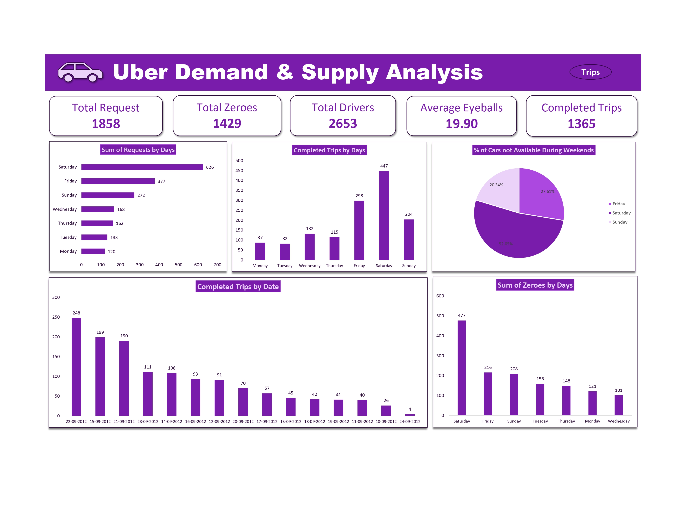
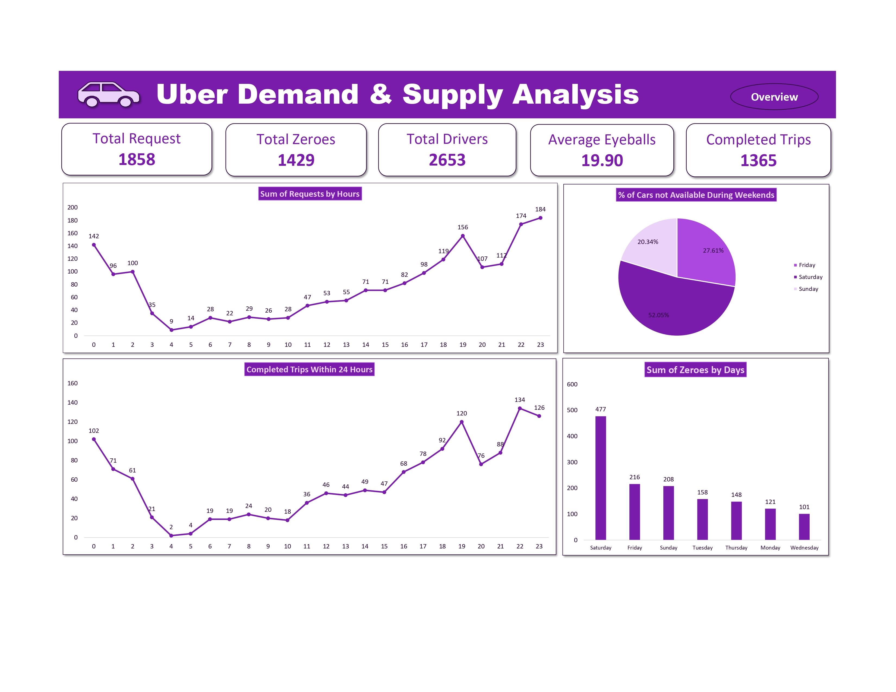

---

# Uber Demand and Supply Gap Analysis (2016)

---

## Project Overview  
This project aims to analyze Uber's 2016 request data to uncover significant gaps between rider demand and driver supply. The analysis focuses on identifying key patterns, particularly times when demand outstrips supply, to provide actionable insights for improving Uber's operational efficiency.

---

## Dataset
- **Source:** Uber 2016 Request Data
- **Key Features:**
  - **Eyeballs:** App openings representing rider demand
  - **Zeroes:** Instances where no drivers are available
  - **Requests:** Successful ride requests representing fulfilled demand
- **Timeframe:** 2016, with a focus on daily and weekend patterns

---

## Objectives  
1. **Identify Supply-Demand Imbalance:** Uncover periods where rider demand exceeds driver supply.
2. **Optimize Driver Availability:** Highlight specific hours and days, especially weekends, where additional drivers are needed.
3. **Understand Weekend Demand:** Analyze the impact of weekend demand spikes on driver availability.
4. **Provide Actionable Insights:** Offer recommendations to optimize Uber's driver allocation strategy.
5. **Enhance Customer Experience:** Minimize customer frustration by reducing the frequency of "Zeroes" (no drivers available).

---

## Methodology
1. **Data Cleaning:**  
   Handled missing and inconsistent data, ensuring clean, accurate analysis.
  
2. **Demand-Supply Analysis:**  
   Grouped data into time blocks (hourly, daily, and weekend) to analyze the gaps between demand (Eyeballs) and supply (Requests and Zeroes).
   
3. **Ratio Calculation:**  
   Computed the ratio of unmet demand (Zeroes) to overall demand (Eyeballs) for different periods.

4. **Key Metrics:**  
   - **Eyeballs-to-Zeroes Ratio**: To identify critical periods where rider demand is unmet.
   - **Request Success Rate**: Evaluated how efficiently Uber fulfills ride requests.

5. **Visualization:**  
   Created charts and graphs for demand trends, driver supply, and Zero occurrences to present findings visually.

---

## Key Insights
1. **Weekend Gaps:**  
   - **Saturday** shows the largest supply gap, with **52.05%** of customers unable to find available drivers.
   - **Friday** has a **27.61%** no-availability rate.
   - **Sunday** has **20.34%** unmet demand.
   
2. **Driver Shortages:**  
   Peak demand hours on weekends see significant driver shortages, requiring improved scheduling to balance supply.

---

## Recommendations
1. **Increase Driver Supply on Weekends:**  
   Prioritize adding more drivers on Saturdays and Fridays, especially during high-demand periods (evening to night).

2. **Dynamic Driver Scheduling:**  
   Introduce dynamic scheduling models to shift more drivers to high-demand periods, reducing Zeroes.

3. **Incentivize Drivers:**  
   Offer incentives for drivers to work on weekends and during peak hours to meet demand surges effectively.

---

## Conclusion  
The analysis clearly indicates a mismatch between rider demand and driver availability, particularly on weekends. By targeting specific periods where Zeroes are highest, Uber can improve customer satisfaction and operational efficiency. Implementing these recommendations will minimize unmet demand, enhance the user experience, and potentially increase ride completions during high-demand times.

---

## Tools Used
- **Data Processing:** Python (Pandas, NumPy)
- **Visualization:** Matplotlib, Seaborn
- **Analysis Tools:** Excel, Jupyter Notebook

---

## License
This project is licensed under the MIT License. You can read about the [MIT License](https://opensource.org/licenses/MIT) for details. Essentially, it allows others to use, modify, and distribute your work as long as they include the original license and copyright notice.

---

## Contact Information
- **Author:** Kunal Malviya
- **LinkedIn:** [Kunal Malviya](https://www.linkedin.com/in/kunal-malviya-0b6340289/)
- **Portfolio:** [Kunal's Portfolio](https://peerlist.io/kunalmalviya06)

---
